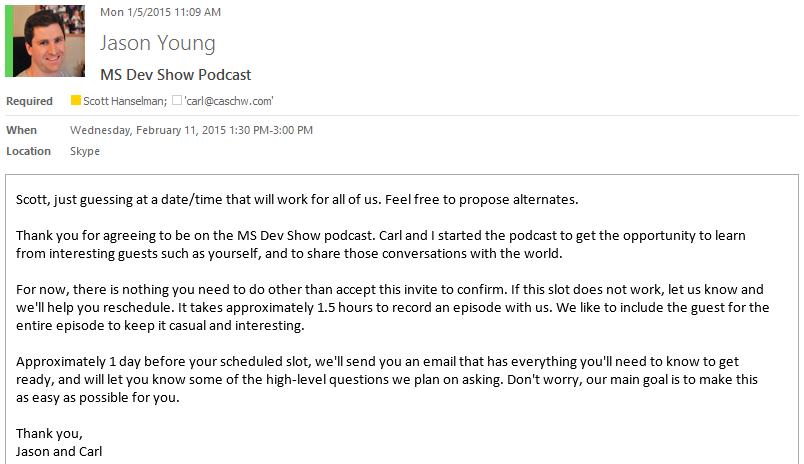
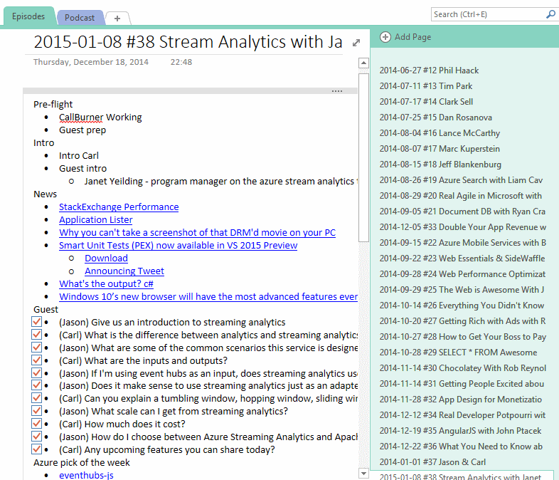
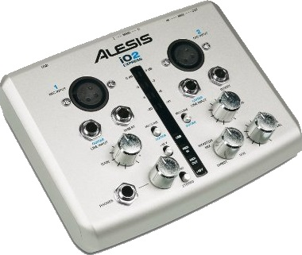
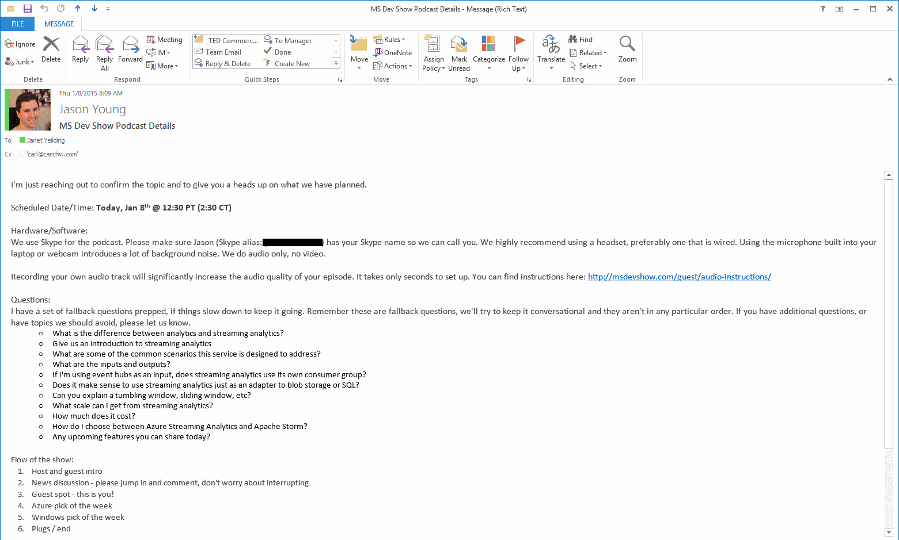
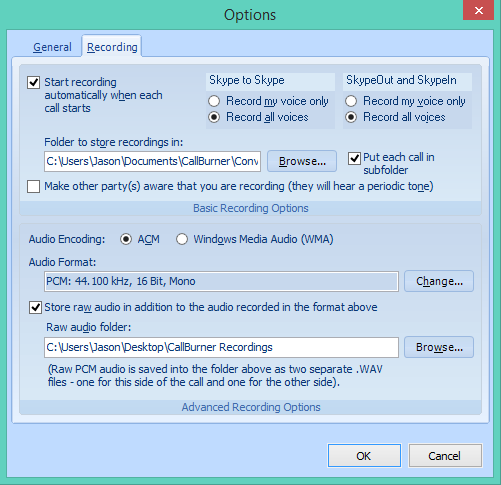
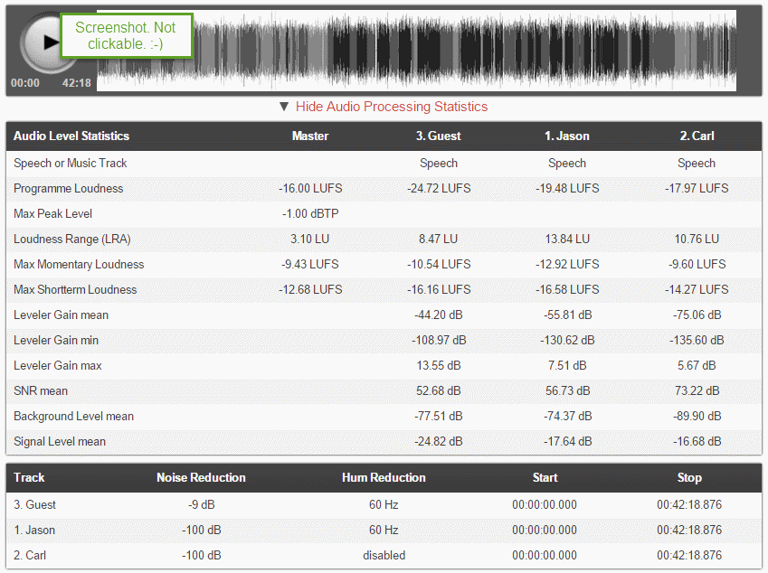
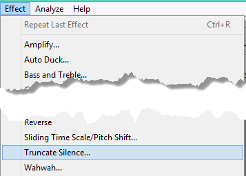

We've gotten a lot of questions about how we get great sound on the [MS Dev Show](http://msdevshow.com). From the start, Carl and I knew that great sound wouldn't make us successful, but bad sound could definitely hurt us.

A lot of podcasts have just... ended. It seems to happen somewhere between episode 20 and 100. I knew how important it was to make the podcast take the absolute minimum time commitment.

Today, I'm sharing our entire process.

Many podcasts won't talk about this. I'm not sure if it's too much inside baseball, or if they think they are trade secrets. Well, I'm all about sharing.

From a high-level, we find guests, prepare, record, edit, and publish.

### Guests

Guests are a big part of our show. We've always wanted to have interesting guests. We occasionally have some names you've heard of, but we also love to have guests that haven't been on a podcast before.

>I believe that everyone has a story, an we want to hear it.

Since guests have to take time out of their important schedule for us, our goal is to make it as easy as possible, with a minimal time commitment. Once a guest accepts and we work out a time slot, we have a template invite we send them. Templates are absolutely key to our communications, and allow us to be clear and concise. As we improve our process, we evolve our templates.

Around 24 hours before the episode is scheduled to record, we send another email template that contains a rough idea of the questions Carl and I want to ask, and everything the guest needs to know to get set up. More on that later.

### Preparation

OneNote is what powers the MS Dev Show. All of our processes, templates, and episode details are in a OneNote notebook that Carl and I share.

As Carl and I come across stories we think would be worth discussing, we put links into a OneNote page for the associated episode.

We also use OneNote while we're recording, back to that in just a bit.

### Hardware

You might think this is the most important part, and you'd be partially right. For our mics, we copied [TWiT](http://twit.tv/), and use the [Heil PR-40](http://www.amazon.com/gp/product/B00PQYBRNY?tag=ytechie-20). At ~$330, it's pricey related to other mics, but cheap compared to the computer you're plugging it into.

Lesson time. The Heil is a dynamic ***microphone**. Some people use condenser mics, but condenser mics do a horrible job cutting out background sound. Dynamic mics do a good job of only picking up the sound right in front of them. This is key for Carl and I since we're recording from our home offices and have kids and pets.

Our mics are connected to the [Alesis IO2 Express](http://www.amazon.com/gp/product/B003HR30FU/?tag=ytechie-20). This is what converts the signal from our mics to USB to connect to our computers.

Using an insert cable, we route the mic sound through the [Behringer MDX1600](http://www.amazon.com/gp/product/B0002E4ZJ6/?tag=ytechie-20) compressor/gate/limiter. This primary serves to "gate" our audio, or essentially turn it off when we're not speaking. This is our first line of defense against barking dogs, screaming kids, and loud keyboards. I now believe this equipment is optional thanks to improved software processing that I'll describe later.

### Recording

Around 24 hours before we record, we send the guest an email reminder with additional details.

We use Skype to talk to our guests. Carl and I both use Callburner to record all sides of the conversation. Since we both have complete copies of the call, we can be fairly confident that even if we have a technical failure, we'll still be able to fall back to a second copy.

Way always record our tracks in raw WAV format:

Additionally, we ask our guests to record their own microphone input. We include [simple instructions](http://msdevshow.com/guest/) to make it as painless as possible. When everything goes according to plan, we have a **separate** track for every person on the call. One track for me, one track for Carl, and one track for the guest.

As we go through the episode, we use OneNote as a guide. We use it to make sure we don't forget any big, important questions, and we use it to mark off questions that were already asked. Since OneNote updates on both sides in near real-time, it allows us to run the show as we go, without stopping or IM'ing.

### Editing

Short version: trim, Auphonic processing, truncate silence, finishing touches.

First, I use [Audacity](http://audacity.sourceforge.net/) to trim the tracks. Audacity is free software that works amazingly well. They always have some pre-show and post-show chat, so I cut them down to the meat, and make them all the same length.

Next, is noise reduction. This is an area that can eat up a lot of time if you let it. In the early episodes, I did minimal manual edits. As I started to desire higher quality, I found myself spending more and more time on editing. We're not talking about major edits, it was more about removing breaths, clicks, etc. I was getting desperate to cut this down. I was willing to try anything. I even tried Adobe Audition, but it is obvious that it wasn't really designed to edit a podcast. Don't get me wrong, it's fully capable, it's just not optimized for a podcast workflow.

Then, a miracle. I found a website called [Auphonic](https://auphonic.com/). It's unbelievable at processing audio. It has amazing noise reduction, which is key for guests since they don't have gates. It also intelligently focuses on the track of the person that is speaking, and attenuates the other voices. This is amazingly effective. Other than our gate, this is the only audio processing we do. This software is good enough that you could skip the compressor/gate/limiter completely. It works fine if you have 1 track, but even better if you have separate tracks for each speaker. All of the settings we use for the show have been saved as a preset, so it takes less than 60 seconds to submit a processing job.

After Auphonic works its magic, I bring it back into Audacity. Then, I use a feature called **truncate silence** (under the "Effect" Menu). This is one of our best kept secrets. It takes out pauses in the audio that are longer than a certain duration, and shortens them up. The end result is that even if someone takes a moment to answer a question, it will sound like they answered without pausing. In a typical hour long episode, this takes out around **4 full minutes**.

#### Adding the Intro/Outro

I record the intro text directly into audacity. "Welcome to the MS Dev Show, episode number....". I place this track below the intro music track. Then, I use the "Auto Duck" option under the "Effect" menu. This automatically turns down the volume while I'm talking. If I had a long pause in the intro voice, the theme music would actully come back up and fill it in. Lastly, I use the Envelope Tool to make the intro sound fade in. I started doing this since the riff at the start of the intro can be a bit glaring.

The outro is pre-recorded for convenience, and I just put it at the end.

### Publishing

The easiest way to publish your podcast is to use [Libsyn](https://www.libsyn.com/). It's fairly inexpensive, and you pay monthly for new episodes. The great part is that you don't pay for old episodes. They handle everything for you from hosting the files to providing the streams that you can submit to aggregators like iTunes and Stitcher. Make sure you check on those services to ensure the stream is set up the way you want.

### Credits

* [TWiT Podcasting Equipement](http://twit.tv/podcastequipment)
* [Ryan Lowdermilk's Setup](http://ryanlowdermilk.com/2012/08/the-secret-behind-exceptional-podcast-audio/) - Inspiration for the gate and USB interface.