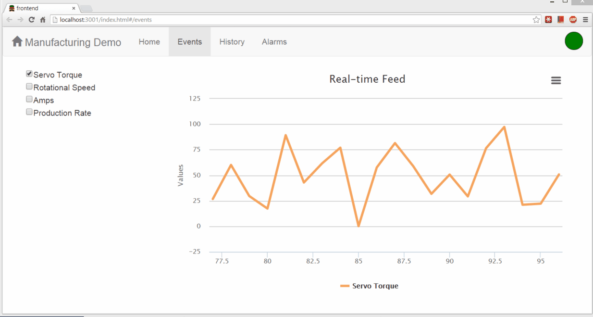

You don't have to go very far into the past to find yourself in a time where pushing data from a server to a client was a huge pain. Sure, you could use tricks like polling or long-polling, but it was difficult and error prone. Fortunately, we have technologies today that make it drop dead simple without complexity or bad performance.

If you're using a technology like Node.js, then something like [Socket.io](http://socket.io/) or [Faye](http://faye.jcoglan.com/) is for you. They're not the focus of this post, but they are both extremely easy to use.

### SignalR

SignalR is based on the concept of hubs. You create hubs in your .NET application (ASP.NET/MVC/etc). Here is what a simple hub can look like:

    public class ChatHub : Hub
    {
        public void Send(string name, string message)
        {
            Clients.All.broadcastMessage(name, message);
        }
    }

If you haven't used SignalR, Be sure to familiarize yourself with the above example before moving on. The **server** calls the *Send* method, and that method calls **broadcastMessage** on all of the connected clients.

SignalR is awesome for a few reasons:

* It makes our life easy by hiding the complex process of determining how to connect to a server.
* SignalR is also extremely fast. It's hard to find benchmarks, but I've read reports of getting 10,000+ calls/sec with a single server.
* It is possible to scale out to multiple servers.

### The Scenario

In my [manufacturing projects](https://github.com/search?q=user%3Aytechie+manufacturing.), I wanted an easy way for web clients to subscribe to real-time data streams.

On the left is a list of streams that the user can subscribe to, and the chart on the right plots those values as they arrive from the server.

### The Server Implementation

The easiest way to wire up SignalR for our scenario is to use the [Microsoft ASP.NET SignalR OWIN Nuget Package](http://www.nuget.org/packages/Microsoft.AspNet.SignalR.Owin). OWIN gives us an easy way to inject functionality into our server. To enable OWIN, we'll also need to pull in the [Microsoft.Owin.Host.SystemWeb Nuget Package](http://www.nuget.org/packages/Microsoft.Owin.Host.SystemWeb/).

Once those packages are installed, SignalR can be wired up simply by adding a file with the following contents:

	using Microsoft.Owin;
	using Owin;
	
	[assembly: OwinStartup(typeof(MyNamespace.Startup))]
	
	namespace MyNamespace
	{
		public class Startup
		{
			public void Configuration(IAppBuilder app)
			{
				app.MapSignalR();
			}
		}
	}

That's how easy it is.

Some quick background. A hub is just a regular class that inherits from Hub. Just keep in mind that hubs are transient, meaning that anything you store in a member property will be lost in the next call. That's actually a good thing since we may be spanning multiple servers. Storing any state should happen outside of the hub.

Now, let's create our first Hub:

	using Microsoft.AspNet.SignalR;
	using Microsoft.AspNet.SignalR.Hubs;
	
	namespace Manufacturing.Api.Hubs
	{
	    public class DatasourceRecord : Hub
	    {
		}
	}

It doesn't do anything yet, but it gives us a place to put our methods.

To allow clients to subscribe to the streams they're interested in, I'm going to use a feature in SignalR called [*Groups*](http://www.asp.net/signalr/overview/guide-to-the-api/working-with-groups). Groups give us a way to fan out data to clients that belong to that group. Remember how I said that hubs can't store state? Groups **do** store the mapping between clients and groups.

Let's provide some methods for the client to register for streams they're interested in:

(Note: I call them *Datasources*)

		public const string GroupLabelPrefix = "Datasource_";

        public void Register(int datasourceId)
        {
            Groups.Add(Context.ConnectionId, GroupLabelPrefix + datasourceId);
        }

        public void Unregister(int datasourceId)
        {
            Groups.Remove(Context.ConnectionId, GroupLabelPrefix + datasourceId);
        }

*Context* is an inherited member that allows us to look up the unique ID of the client making the request. By adding and removing clients in the groups, they're explicitly subscribing to what they're interested in. Security could easily be layered into these methods as needed.

Here is the method call to get data to the subscribed clients:

	public static void NewDataRecord(DataRecord record)
	{
		var context = GlobalHost.ConnectionManager.GetHubContext<DatasourceRecord>();

		var groupName = GroupLabelPrefix + record.DatasourceId;
		var group = context.Clients.Group(groupName);
	    if (group != null)
        {
            group.newRecord(record);
        }
	}

Notice that this method is static, which was intentional. This allows us to easily call into the hub from code elsewhere.

### The Client Implementation

For the web client, we need to pull in the SignalR client libraries. We can get these with the [Microsoft.AspNet.SignalR.JS Nuget package](https://www.nuget.org/packages/Microsoft.AspNet.SignalR.js).

Now add a reference to the client library in your HTML. We also need to reference a special script called *signalr/hubs*. This second reference is a dynamically generated client library based on the server methods that we'll define later.

	
	

* Why SignalR
	* Great performance
	* Connection optimization between polling and websockets
* Routing data using groups
* Sending data
* Client code 